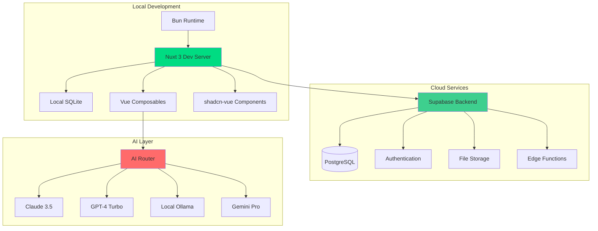

# Flowductiv - Technical Implementation Plan

> **Modern architecture foundation and technical design decisions**

## 🏗️ **Modern Architecture Foundation**

### **Technology Stack Evolution**
```
Previous → Modern Improvement
Vue 3 + Vuetify → Nuxt 3 + shadcn-vue + Tailwind
IndexedDB → Supabase + Local SQLite (Drizzle ORM)
npm + ESLint → Bun + Biome (10x faster)
Vitest → Vitest + Playwright (E2E)
Single AI → Multi-modal AI Router
Pinia → Nuxt State + Composables
```

### **Development Environment Architecture**


## 📋 **Phase Technical Milestones**

### **✅ Phase 0: Foundation (Complete)**
**Technical Deliverables:**
- Nuxt 3 + TypeScript + Bun development environment
- Drizzle ORM with SQLite for rapid prototyping
- shadcn-vue component library integration
- Basic timer functionality with Vue 3 Composition API
- Test infrastructure (Vitest + happy-dom)

### **✅ Phase 1A: Core MVP (Complete)**
**Technical Deliverables:**
- Smart input parsing with centralized service architecture
- Multi-provider AI router with fallback mechanisms
- Real-time auto-complete with debounced API calls
- Test-driven development with comprehensive coverage
- API security foundation with server-side key management

**Key Architectural Decisions:**
- **Composables over Stores**: Vue 3 Composition API replaces Pinia
- **TDD Methodology**: Red→Green→Refactor→Commit cycles throughout
- **API Security**: Server-side only key management, zero client exposure
- **Provider Architecture**: Extensible AI router ready for additional providers

### **✅ Phase 1B: Mobile-First UX (COMPLETED)**
**Technical Achievements:**
- **Responsive Architecture**: Desktop/mobile component switching with SSR compatibility
- **Touch Optimization**: 44px touch targets, iOS safe areas, haptic feedback
- **Component Architecture**: 70% code reduction through reusable UI patterns
- **Simple Navigation**: Standard mobile patterns replacing complex gesture system

**Delivered Technical Components:**
- `useViewport()` - Device detection and orientation handling
- `TimerSectionMobile.vue` - Touch-optimized mobile interface
- Mobile-optimized components and responsive design patterns
- Production-ready mobile experience with integrated desktop navigation

### **🎯 Phase 1C: Core Architecture Complete**
**Technical Achievement:** Two-section sidebar architecture with comprehensive filtering system

**Delivered Components:**
- **AnalyticsSidebar.vue** - Two-section layout (Insight Area + Filter Area)
- **DurationSlider.vue** - Range slider component for duration filtering
- **SavedFilterCombinations.vue** - Filter preset management
- **Filter Components** - PriorityFilter, FocusFilter, TagFilters integrated in sidebar

**Architecture Pattern:**
```typescript
// Insight Area (Analytics - View Only)  
interface InsightArea {
  heatmap: 'ProductivityOverview'     // Productivity visualization
  patterns: 'PatternInsights'         // Trend analysis  
  aiInsights: 'DailySummary'          // AI-generated insights
}

// Filter Area (Interactive Controls)
interface FilterArea {
  favorites: 'SavedFilterCombinations'  // Saved filter presets
  priority: 'PriorityFilter'           // 1-5 rating controls
  focus: 'FocusFilter'                 // 1-5 rating controls  
  duration: 'DurationSlider'           // Min/max range slider
  tags: 'TagFilters'                   // Tag filtering controls
}
```

### **🔄 Phase 2: Advanced Analytics & Habits (Future)**
**Technical Focus:** Advanced pattern analysis and habit tracking systems  

### **🤖 Phase 3: AI Intelligence & Automation (Future)**
**Technical Focus:** Predictive analytics and automated productivity coaching

---

## 🚀 **Deployment Strategy**

### **Development → Production Pipeline**

#### **Local Development (Current)**
```bash
bun dev                    # Local development server
Local SQLite              # Development database
```

#### **Production Deployment**
```bash
Vercel                    # Hosting platform (excellent Bun support)
Supabase                  # Production database (PostgreSQL)
Bun                       # Package manager (faster builds on Vercel)
```

### **Database Migration Strategy**
```typescript
// Environment-based database selection
// server/database/index.ts
export const getDatabase = () => {
  if (process.env.NODE_ENV === 'production') {
    // Production: Supabase PostgreSQL
    return drizzle(postgres(process.env.DATABASE_URL!))
  } else {
    // Development: Local SQLite
    return drizzle(new Database('local.db'))
  }
}
```

**Migration Phases:**
1. **Phase 0-1A**: SQLite for MVP development speed
2. **Phase 1B**: Add Supabase configuration alongside SQLite
3. **Phase 1C**: Switch production to Supabase, keep SQLite for dev
4. **Phase 2+**: Optional dev environment consistency

**Deployment Commands:**
```bash
# Vercel deployment (auto-detects Bun)
vercel --prod

# Database migration to Supabase
bun run db:migrate:prod
```

**Strategic Benefits:**
- ✅ **Zero downtime** migration path
- ✅ **Bun optimization** on Vercel (faster builds)
- ✅ **Cost-effective** development (free SQLite)
- ✅ **Scalable** production (Supabase)
- ✅ **Industry standard** stack for portfolio

---

## 🧪 **Testing & Quality Strategy**

### **Testing Architecture**
- **Integration Tests**: Primary approach combining unit + API testing
- **Component Tests**: User behavior focus with Vue Test Utils + Nuxt 3
- **E2E Tests**: Complete workflows for critical paths (Playwright)

### **Performance Benchmarks**
- **Page Load**: <1 second initial load
- **Timer Operations**: <200ms response time
- **AI Summary**: <5 seconds generation
- **Test Suite**: <30 seconds total execution

### **Quality Standards**
- **Coverage**: 75% for critical paths (timer, activities, AI)
- **TypeScript**: Strict compilation with proper interfaces
- **Accessibility**: ARIA attributes and keyboard navigation
- **Security**: Input validation and parameterized queries

---

## 🔧 **Key Technical Patterns**

### **Vue 3 Composition API Pattern**
```typescript
// ✅ Readonly state exposure pattern
export const useTimer = () => {
  const isRunning = ref(false)
  const currentActivity = ref('')
  
  return {
    // Readonly state
    isRunning: readonly(isRunning),
    currentActivity: readonly(currentActivity),
    // Actions
    startTimer: () => { /* implementation */ },
    stopTimer: () => { /* implementation */ }
  }
}
```

### **API Security Implementation**

#### **Security Headers Middleware**
```typescript
// server/middleware/security.ts - Custom implementation
export default defineEventHandler(async (event) => {
  // Essential security headers
  setHeader(event, 'X-Content-Type-Options', 'nosniff')
  setHeader(event, 'X-Frame-Options', 'DENY')
  setHeader(event, 'X-XSS-Protection', '1; mode=block')
  setHeader(event, 'Referrer-Policy', 'strict-origin-when-cross-origin')
  
  // API-specific CORS and cache control
  if (event.node.req.url?.startsWith('/api/')) {
    setHeader(event, 'Access-Control-Allow-Origin', '*')
    setHeader(event, 'Cache-Control', 'no-cache, no-store, must-revalidate')
  }
})
```

**Security Architecture Decision**:
- **Current**: Custom middleware (Phase 1B) - reliable, essential headers
- **Rationale**: nuxt-security module caused server crashes during setup
- **Coverage**: Core attack vectors (XSS, clickjacking, MIME sniffing)
- **Production**: Consider nuxt-security for Phase 1C+ with minimal config
- **Real Protection**: Application-level rate limiting via focus time gates

#### **Application-Level Rate Limiting**
```typescript
// server/utils/focusTimeCalculator.ts
export async function calculateNewFocusTime(userId: string | null, currentActivities: any[]) {
  const MIN_FOCUS_TIME_MS = 60 * 60 * 1000 // 1 hour
  const MIN_ACTIVITY_COUNT = 3 // Minimum activities
  
  // Calculate focus time since last AI summary
  const totalNewFocusTime = /* calculation logic */
  return {
    canRequestSummary: totalNewFocusTime >= MIN_FOCUS_TIME_MS && activityCount >= MIN_ACTIVITY_COUNT,
    progressPercent: Math.round((totalNewFocusTime / MIN_FOCUS_TIME_MS) * 100),
    timeToNextSummary: formatDuration(remainingTime)
  }
}
```

#### **API Endpoint Security Pattern**
```typescript
// server/api/ai/daily-summary.post.ts
export default defineEventHandler(async (event) => {
  // Input validation
  const body = await readBody(event)
  if (!body.activities?.length) {
    throw createError({ statusCode: 400, statusMessage: 'Activities required' })
  }

  // Application-level rate limiting
  const focusAnalysis = await calculateNewFocusTime(null, body.activities)
  if (!focusAnalysis.canRequestSummary) {
    throw createError({
      statusCode: 429,
      statusMessage: 'Track more focus time to unlock AI summary',
      data: { progress: focusAnalysis.progressPercent, timeRemaining: focusAnalysis.timeToNextSummary }
    })
  }

  // Protected API key access
  const config = useRuntimeConfig()
  const aiResponse = await aiRouter.generate(prompt, { apiKey: config.anthropicApiKey })
})
```

### **Mobile-First Component Pattern**
```vue
<template>
  <component 
    :is="isMobile ? 'TimerSectionMobile' : 'TimerSection'"
    v-bind="$attrs"
    @timer-started="handleTimerStart"
  />
</template>

<script setup lang="ts">
const { isMobile } = useViewport()
</script>
```

---

## 📁 **File Structure**
```
├── components/         # Auto-imported Vue components
├── composables/       # Business logic (replaces Pinia stores)  
├── server/api/        # Nuxt 3 API endpoints
├── server/database/   # Drizzle schema and utilities
├── pages/             # File-based routing
├── types/             # TypeScript definitions
├── tests/             # Testing (unit, integration, e2e)
└── docs/              # Project documentation
```

### **Database Schema**
- **Activities**: id, title, durationMs, startTime, endTime, tags, priority, focusRating, energyLevel
- **AI Summaries**: id, date, content, provider, activitiesHash, tokensUsed, generatedAt

### **Key Dependencies**
- **UI**: shadcn-vue, Tailwind CSS, Lucide icons
- **Database**: Drizzle ORM, SQLite (dev) / Supabase (prod)
- **Testing**: Vitest, Vue Test Utils, Playwright, @nuxt/test-utils
- **AI**: Multi-provider router (Claude, GPT-4, Gemini, Ollama)

---

## 🎯 **Success Metrics by Phase**

### **Phase 0**: 
- Daily Active Users: 10-20 (beta testers)
- Session Duration: 20+ minutes average
- Return Rate: 70% next-day return

### **Phase 1A Private Beta**: 
- Daily Active Users: 5-10 (colleagues/close contacts)
- Activities per User: 5+ daily average
- AI Engagement: 80% view daily summary (higher with small group)
- Retention Rate: 60% use for 5+ consecutive days
- Feedback Quality: 100% provide detailed feedback

### **Phase 1B Public Beta**: 
- Daily Active Users: 50-100
- Activities per User: 5+ daily average
- AI Engagement: 60% view daily summary

### **Phase 1B**: 
- Mobile Adoption: 60%+ sessions on mobile devices
- Progressive Unlock: 80% retention at 7+ days
- Security: Zero API key incidents, 40% use provider selection

### **Phase 1C**: 
- Analytics Engagement: 70% interact with heatmap, 80% click day details
- Dashboard Experience: Unified experience, 85% reduction in page navigation
- Goal Setting: 60% adoption rate, 40% achieve streak goals
- Mobile Analytics: 90% mobile users access analytics panel
- User Satisfaction: NPS > 40 (improved through visual engagement)

### **Phase 2**: 
- Habit Formation: 70% of users track 3+ habits
- Session Quality: 80% of sessions include ratings
- Calendar Integration: 60% adoption rate

### **Phase 3**: 
- Pattern Discovery: 70% receive meaningful insights
- Recommendation Action: 40% act on AI suggestions
- Advanced Features: 50% use auto-categorization

## 🛡️ **Application-Level Rate Limiting Strategy**

**Decision**: Focus Time Gates instead of technical rate limiting
- **Rationale**: Converts rate limiting from a restriction into a productivity feature
- **Implementation**: Require 1+ hour of new tracked time since last AI summary
- **Benefits**:
  - Encourages actual focus work over frequent AI requests
  - Prevents AI abuse naturally through app engagement
  - Aligns perfectly with app's core purpose (productivity tracking)
  - Provides cost control while improving user experience
  - Creates positive feedback loop: more focus work → better AI insights
- **User Experience**: Progressive unlock system where focus time "earns" AI features
- **Fallback**: Technical rate limiting (5 req/hour) for abuse prevention only

## ⚠️ **Risk Mitigation per Phase**
- **Technical Risks**: Feature flags for gradual rollout
- **User Adoption**: Onboarding optimization based on drop-off analysis  
- **AI Quality**: A/B testing of different prompt strategies
- **Performance**: Progressive enhancement and offline-first design

---

**Architecture Status**: Phase 1C complete - Mobile-first UX with comprehensive filtering system and two-section sidebar architecture. Foundation ready for advanced analytics and habit tracking features.