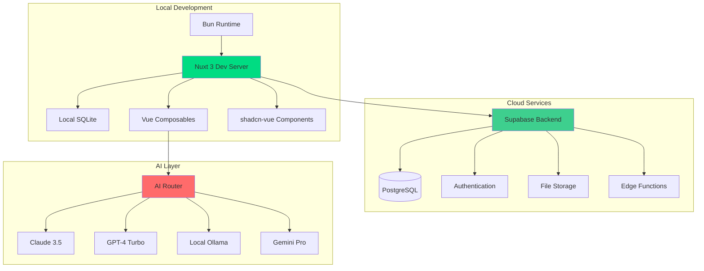

# Flowductiv - Technical Implementation Plan

> **Modern architecture and development roadmap**

## 🏗️ **Modern Architecture Foundation**

### **Technology Stack Evolution**
```
Previous → Modern Improvement
Vue 3 + Vuetify → Nuxt 3 + shadcn-vue + Tailwind
IndexedDB → Supabase + Local SQLite (Drizzle ORM)
npm + ESLint → Bun + Biome (10x faster)
Vitest → Vitest + Playwright (E2E)
Single AI → Multi-modal AI Router
Pinia → Nuxt State + Composables
```

### **Development Environment Architecture**


## 📋 **Phase 0: Proof of Concept (2 weeks)**

### **Sprint 0.1: Development Environment Setup (3 days)**

#### **Task 0.1.1: Initialize Modern Project Structure**
```bash
# Project initialization with Bun
mkdir ai-focus-guard && cd ai-focus-guard
bun create nuxt@latest .
bun add @nuxtjs/supabase drizzle-orm @ai-sdk/vue
bun add -d @nuxtjs/tailwindcss drizzle-kit vitest playwright
```

**Files to Create:**
- `nuxt.config.ts` - Modern Nuxt configuration with modules
- `drizzle.config.ts` - Database ORM configuration  
- `biome.json` - Lightning-fast linting configuration
- `tsconfig.json` - Enhanced TypeScript setup
- `app.vue` - Root application component

**Verification Criteria:**
- [ ] `bun dev` starts development server in <2 seconds
- [ ] Hot-reload works for all file types
- [ ] TypeScript provides full intellisense
- [ ] Biome linting runs in <100ms

#### **Task 0.1.2: Database Schema Design**
```sql
-- schema/activities.sql
CREATE TABLE activities (
  id UUID PRIMARY KEY DEFAULT gen_random_uuid(),
  title TEXT NOT NULL,
  description TEXT,
  duration_ms INTEGER NOT NULL,
  start_time TIMESTAMPTZ NOT NULL,
  end_time TIMESTAMPTZ NOT NULL,
  tags TEXT[] DEFAULT '{}',
  priority INTEGER CHECK (priority IN (1, 2, 3)),
  focus_rating INTEGER CHECK (focus_rating BETWEEN 1 AND 5),
  energy_level TEXT CHECK (energy_level IN ('low', 'medium', 'high')),
  user_id UUID REFERENCES auth.users(id),
  created_at TIMESTAMPTZ DEFAULT NOW(),
  updated_at TIMESTAMPTZ DEFAULT NOW()
);

CREATE INDEX idx_activities_user_date ON activities(user_id, DATE(start_time));
CREATE INDEX idx_activities_tags ON activities USING GIN(tags);
```

**Files to Create:**
- `server/database/schema.ts` - Drizzle schema definitions
- `server/database/migrations/` - Database migration files
- `types/database.ts` - TypeScript type definitions

**Verification Criteria:**
- [ ] Database schema supports all planned features
- [ ] Indexes optimize for common query patterns
- [ ] TypeScript types are auto-generated from schema
- [ ] Migrations run successfully on fresh database

#### **Task 0.1.3: Basic Authentication Setup**
```typescript
// composables/useAuth.ts
export const useAuth = () => {
  const supabase = useSupabaseClient()
  const user = useSupabaseUser()
  
  return {
    user: readonly(user),
    signIn: (email: string, password: string) => 
      supabase.auth.signInWithPassword({ email, password }),
    signUp: (email: string, password: string) => 
      supabase.auth.signUp({ email, password }),
    signOut: () => supabase.auth.signOut()
  }
}
```

**Files to Create:**
- `composables/useAuth.ts` - Authentication composable
- `middleware/auth.ts` - Route protection middleware
- `pages/auth/` - Authentication pages
- `components/Auth/` - Auth-related components

**Verification Criteria:**
- [ ] User can register with email/password
- [ ] User can login and logout successfully  
- [ ] Protected routes redirect to login
- [ ] User state persists across browser sessions

### **Sprint 0.2: Core Timer Implementation (4 days)**

#### **Task 0.2.1: Timer Composable Logic**
```typescript
// composables/useTimer.ts
export const useTimer = () => {
  const isRunning = ref(false)
  const isPaused = ref(false)
  const startTime = ref<number | null>(null)
  const elapsedMs = ref(0)
  const currentActivity = ref<string>('')
  
  const startTimer = (activity: string) => {
    currentActivity.value = activity
    startTime.value = Date.now()
    isRunning.value = true
    isPaused.value = false
  }
  
  const pauseTimer = () => {
    if (isRunning.value) {
      elapsedMs.value += Date.now() - startTime.value!
      isPaused.value = true
      isRunning.value = false
    }
  }
  
  const resumeTimer = () => {
    if (isPaused.value) {
      startTime.value = Date.now()
      isRunning.value = true
      isPaused.value = false
    }
  }
  
  const finishTimer = async () => {
    if (isRunning.value || isPaused.value) {
      const totalMs = isPaused.value 
        ? elapsedMs.value 
        : elapsedMs.value + (Date.now() - startTime.value!)
      
      await saveActivity({
        title: currentActivity.value,
        duration_ms: totalMs,
        start_time: new Date(startTime.value!),
        end_time: new Date()
      })
      
      resetTimer()
    }
  }
  
  return {
    isRunning: readonly(isRunning),
    isPaused: readonly(isPaused),
    elapsedMs: readonly(elapsedMs),
    currentActivity: readonly(currentActivity),
    startTimer,
    pauseTimer,
    resumeTimer,
    finishTimer
  }
}
```

**Files to Create:**
- `composables/useTimer.ts` - Core timer logic
- `composables/useInterval.ts` - Reactive interval utility
- `components/Timer/TimerControls.vue` - Timer UI component
- `components/Timer/TimerDisplay.vue` - Time display component

**Verification Criteria:**
- [ ] Timer starts, pauses, resumes accurately
- [ ] Time display updates every second
- [ ] Timer state persists across browser refresh
- [ ] Multiple timers can be tracked sequentially

#### **Task 0.2.2: Activity Storage System**
```typescript
// composables/useActivities.ts
export const useActivities = () => {
  const activities = ref<Activity[]>([])
  const loading = ref(false)
  
  const saveActivity = async (activity: ActivityInput) => {
    loading.value = true
    try {
      const { data } = await $fetch('/api/activities', {
        method: 'POST',
        body: activity
      })
      activities.value.unshift(data)
      return data
    } finally {
      loading.value = false
    }
  }
  
  const getActivitiesForDate = async (date: Date) => {
    const { data } = await $fetch('/api/activities', {
      query: { 
        date: date.toISOString().split('T')[0]
      }
    })
    return data
  }
  
  return {
    activities: readonly(activities),
    loading: readonly(loading),
    saveActivity,
    getActivitiesForDate
  }
}
```

**Files to Create:**
- `composables/useActivities.ts` - Activity management
- `server/api/activities/` - API endpoints
- `components/Activity/ActivityList.vue` - Activity display
- `components/Activity/ActivityItem.vue` - Individual activity

**Verification Criteria:**
- [ ] Activities save to database successfully
- [ ] Activities load on page refresh
- [ ] Activity list updates in real-time
- [ ] Error handling for network failures

### **Sprint 0.3: Basic UI Implementation (3 days)**

#### **Task 0.3.1: Component Library Setup**
```bash
# Install shadcn-vue components
bunx shadcn-vue@latest init
bunx shadcn-vue@latest add button input card
bunx shadcn-vue@latest add badge separator
```

**Files to Create:**
- `components/ui/` - shadcn-vue base components
- `app.vue` - Main application layout
- `pages/index.vue` - Dashboard page
- `assets/css/` - Global styles and theme

**Verification Criteria:**
- [ ] All UI components follow consistent design system
- [ ] Dark/light theme toggles work correctly
- [ ] Mobile responsive layout functions properly
- [ ] Accessibility standards are met (WCAG 2.1)

#### **Task 0.3.2: Main Dashboard Layout**
```vue
<!-- pages/index.vue -->
<template>
  <div class="min-h-screen bg-background">
    <Header />
    <main class="container mx-auto px-4 py-8">
      <div class="grid grid-cols-1 lg:grid-cols-3 gap-6">
        <div class="lg:col-span-2">
          <TimerSection />
          <ActivityList :activities="todaysActivities" />
        </div>
        <div>
          <DailySummary />
          <RecentInsights />
        </div>
      </div>
    </main>
  </div>
</template>
```

**Files to Create:**
- `pages/index.vue` - Main dashboard
- `components/Layout/Header.vue` - Application header
- `components/Timer/TimerSection.vue` - Timer interface
- `components/Dashboard/` - Dashboard-specific components

**Verification Criteria:**
- [ ] Dashboard loads in <1 second
- [ ] All components are properly positioned
- [ ] Layout adapts to different screen sizes
- [ ] Navigation between sections works smoothly

## 📋 **Phase 1A: Core MVP (3 weeks)**

### **Sprint 1A.1: Smart Input System (5 days)**

#### **Task 1A.1.1: Input Parser Service**
```typescript
// services/inputParser.ts
export class InputParserService {
  static parse(input: string): ParsedActivity {
    const tagRegex = /#(\w+)/g
    const priorityRegex = /!([1-3])/
    
    const tags = Array.from(input.matchAll(tagRegex), m => m[1])
    const priorityMatch = input.match(priorityRegex)
    const priority = priorityMatch ? parseInt(priorityMatch[1]) : null
    
    // Remove tags and priority from title
    const cleanTitle = input
      .replace(tagRegex, '')
      .replace(priorityRegex, '')
      .trim()
    
    return {
      title: cleanTitle,
      tags,
      priority,
      originalInput: input
    }
  }
  
  static async enhanceWithAI(parsed: ParsedActivity): Promise<EnhancedActivity> {
    // Use AI to extract description, improve categorization
    const aiResult = await $fetch('/api/ai/enhance-activity', {
      method: 'POST',
      body: { activity: parsed }
    })
    
    return {
      ...parsed,
      description: aiResult.description,
      suggestedTags: aiResult.tags,
      category: aiResult.category
    }
  }
}
```

**Files to Create:**
- `services/inputParser.ts` - Input parsing logic
- `server/api/ai/enhance-activity.ts` - AI enhancement endpoint
- `components/Activity/SmartInput.vue` - Enhanced input component
- `composables/useInputParser.ts` - Reactive parser

**Verification Criteria:**
- [ ] Tags are extracted correctly (95%+ accuracy)
- [ ] Priority parsing works for !1, !2, !3
- [ ] AI enhancement provides meaningful descriptions
- [ ] Input suggestions improve over time

#### **Task 1A.1.2: Auto-complete & Suggestions**
```typescript
// composables/useAutoComplete.ts
export const useAutoComplete = () => {
  const suggestions = ref<string[]>([])
  const recentTags = ref<string[]>([])
  
  const getSuggestions = async (input: string) => {
    // Get recent activities for suggestions
    const { data } = await $fetch('/api/activities/suggestions', {
      query: { input }
    })
    
    suggestions.value = data.activities
    recentTags.value = data.tags
  }
  
  const debouncedGetSuggestions = useDebounceFn(getSuggestions, 300)
  
  return {
    suggestions: readonly(suggestions),
    recentTags: readonly(recentTags),
    getSuggestions: debouncedGetSuggestions
  }
}
```

**Files to Create:**
- `composables/useAutoComplete.ts` - Auto-complete logic
- `server/api/activities/suggestions.ts` - Suggestion API
- `components/Activity/SuggestionDropdown.vue` - Suggestion UI
- `utils/debounce.ts` - Utility functions

**Verification Criteria:**
- [ ] Suggestions appear within 300ms of typing
- [ ] Recent tags are prioritized in suggestions
- [ ] Suggestions improve based on user selection
- [ ] Performance remains smooth with 1000+ activities

### **Sprint 1A.2: AI Integration Foundation (5 days)**

#### **Task 1A.2.1: Multi-Provider AI Router**
```typescript
// services/ai/aiRouter.ts
export class AIRouter {
  private providers: Map<string, AIProvider> = new Map()
  
  constructor() {
    this.providers.set('claude', new ClaudeProvider())
    this.providers.set('openai', new OpenAIProvider())
    this.providers.set('gemini', new GeminiProvider())
    this.providers.set('ollama', new OllamaProvider())
  }
  
  async generateSummary(
    activities: Activity[], 
    options: AIOptions = {}
  ): Promise<AISummary> {
    const provider = this.selectProvider(options)
    
    const prompt = PromptTemplates.dailySummary(activities)
    const result = await provider.complete(prompt)
    
    return {
      content: result.content,
      provider: provider.name,
      tokensUsed: result.usage?.total_tokens,
      generatedAt: new Date()
    }
  }
  
  private selectProvider(options: AIOptions): AIProvider {
    // Provider selection logic based on:
    // - User preference
    // - Task type (speed vs quality)
    // - Cost constraints
    // - Privacy requirements
    
    if (options.privacy === 'local') return this.providers.get('ollama')!
    if (options.speed === 'fast') return this.providers.get('gemini')!
    if (options.quality === 'high') return this.providers.get('claude')!
    
    return this.providers.get('openai')! // default
  }
}
```

**Files to Create:**
- `services/ai/aiRouter.ts` - AI provider routing
- `services/ai/providers/` - Individual AI providers
- `services/ai/prompts.ts` - Centralized prompt templates
- `server/api/ai/summary.ts` - Summary generation endpoint

**Verification Criteria:**
- [ ] All 4 AI providers integrate successfully
- [ ] Provider selection works based on criteria
- [ ] Fallback mechanisms handle provider failures
- [ ] Cost tracking works for each provider

#### **Task 1A.2.2: Daily Summary Generation**
```typescript
// services/ai/prompts.ts
export const PromptTemplates = {
  dailySummary: (activities: Activity[]) => {
    const totalTime = activities.reduce((sum, a) => sum + a.duration_ms, 0)
    const timeByTag = activities.reduce((acc, a) => {
      a.tags.forEach(tag => {
        acc[tag] = (acc[tag] || 0) + a.duration_ms
      })
      return acc
    }, {} as Record<string, number>)
    
    return `
Analyze this day's activities and provide a concise, actionable summary:

Activities (${activities.length} total, ${formatDuration(totalTime)}):
${activities.map(a => `- ${a.title} (${formatDuration(a.duration_ms)}) ${a.tags.join(' ')}`).join('\n')}

Time by category:
${Object.entries(timeByTag).map(([tag, time]) => `- ${tag}: ${formatDuration(time)}`).join('\n')}

Please provide:
1. One-sentence overview of the day
2. Top 2 accomplishments
3. One specific improvement suggestion for tomorrow
4. Time allocation assessment (balanced/unbalanced)

Keep response under 100 words, be encouraging but honest.`
  }
}
```

**Files to Create:**
- `services/ai/prompts.ts` - Prompt template system
- `composables/useAISummary.ts` - Summary management
- `components/AI/DailySummary.vue` - Summary display
- `server/api/ai/summary.ts` - Summary API endpoint

**Verification Criteria:**
- [ ] Summaries are generated within 5 seconds
- [ ] Summary quality is consistent across providers
- [ ] Summaries are cached to avoid regeneration
- [ ] Error handling gracefully manages AI failures

### **Sprint 1A.3: PWA Enhancement (5 days)**

#### **Task 1A.3.1: Advanced PWA Configuration**
```typescript
// nuxt.config.ts
export default defineNuxtConfig({
  modules: [
    '@vite-pwa/nuxt'
  ],
  pwa: {
    registerType: 'autoUpdate',
    workbox: {
      navigateFallback: '/',
      globPatterns: ['**/*.{js,css,html,png,svg,ico}']
    },
    client: {
      installPrompt: true,
      periodicSyncForUpdates: 20
    },
    manifest: {
      name: 'AIFocusGuard',
      short_name: 'FocusGuard',
      description: 'AI-enhanced productivity tracking',
      theme_color: '#3b82f6',
      background_color: '#ffffff',
      display: 'standalone',
      orientation: 'portrait',
      scope: '/',
      start_url: '/',
      icons: [
        {
          src: 'icon-192.png',
          sizes: '192x192',
          type: 'image/png'
        },
        {
          src: 'icon-512.png',
          sizes: '512x512',
          type: 'image/png'
        }
      ]
    }
  }
})
```

**Files to Create:**
- `public/` - PWA icons and manifest
- `composables/usePWA.ts` - PWA functionality
- `components/PWA/InstallPrompt.vue` - Install prompt
- `plugins/pwa.client.ts` - PWA initialization

**Verification Criteria:**
- [ ] App installs successfully on mobile devices
- [ ] Offline functionality works for core features
- [ ] Push notifications can be enabled
- [ ] App updates automatically when available

## 🧪 **Verification & Testing Strategy**

### **Automated Testing Framework**
```typescript
// tests/integration/timer.spec.ts
import { test, expect } from '@playwright/test'

test.describe('Timer Functionality', () => {
  test('complete timer workflow', async ({ page }) => {
    await page.goto('/')
    
    // Start timer
    await page.fill('[data-testid=activity-input]', 'Test task #work !2')
    await page.click('[data-testid=start-timer]')
    
    // Verify timer is running
    await expect(page.locator('[data-testid=timer-status]')).toContainText('Running')
    
    // Wait and finish timer
    await page.waitForTimeout(2000)
    await page.click('[data-testid=finish-timer]')
    
    // Verify activity was saved
    await expect(page.locator('[data-testid=activity-list]')).toContainText('Test task')
  })
})
```

### **Performance Benchmarks**
- **Page Load**: <1 second initial load
- **Timer Start**: <200ms response time  
- **AI Summary**: <5 seconds generation
- **Offline Mode**: Core features work without internet

### **User Acceptance Criteria**
- [ ] New user can complete onboarding in <3 minutes
- [ ] Daily active usage session lasts 15+ minutes
- [ ] User returns for 5+ consecutive days
- [ ] AI insights are rated useful by 70%+ of users

**Ready to start implementation?** This plan provides:

✅ **Modern tech stack** with significant performance improvements  
✅ **Iterative development** with weekly validation cycles  
✅ **Comprehensive testing** strategy  
✅ **Clear success metrics** for each phase  
✅ **Risk mitigation** through incremental rollout  

Which phase would you like me to begin implementing first?