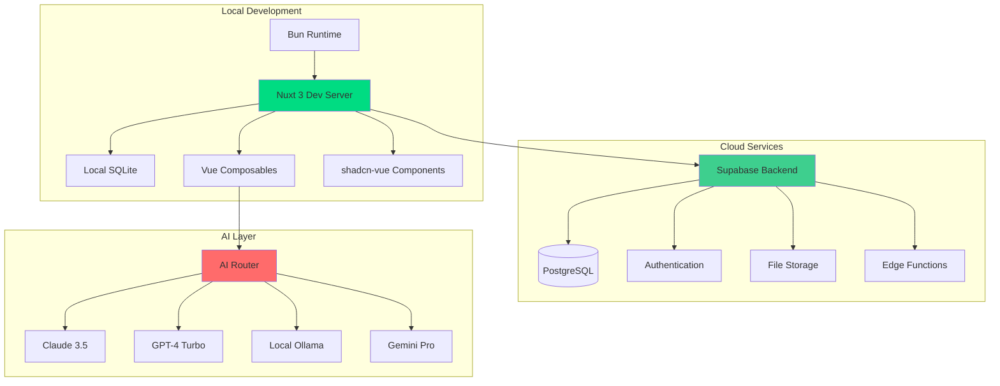

# Flowductiv - Technical Implementation Plan

> **Modern architecture and development roadmap**

## 🏗️ **Modern Architecture Foundation**

### **Technology Stack Evolution**
```
Previous → Modern Improvement
Vue 3 + Vuetify → Nuxt 3 + shadcn-vue + Tailwind
IndexedDB → Supabase + Local SQLite (Drizzle ORM)
npm + ESLint → Bun + Biome (10x faster)
Vitest → Vitest + Playwright (E2E)
Single AI → Multi-modal AI Router
Pinia → Nuxt State + Composables
```

### **Development Environment Architecture**


## 📋 **Phase 0: Proof of Concept (2 weeks) - ✅ COMPLETE**

### **✅ Sprint 0.1: Development Environment Setup (3 days) - COMPLETE**

#### **✅ Task 0.1.1: Initialize Modern Project Structure - COMPLETE**
- ✅ `nuxt.config.ts` - Modern Nuxt configuration with modules
- ✅ `drizzle.config.ts` - Database ORM configuration  
- ✅ `biome.json` - Lightning-fast linting configuration
- ✅ `tsconfig.json` - Enhanced TypeScript setup
- ✅ `app.vue` - Root application component

#### **✅ Task 0.1.2: Database Schema Design - COMPLETE**
- ✅ `server/database/schema.ts` - Drizzle schema definitions
- ✅ `server/database/migrations/` - Database migration files
- ✅ `types/database.ts` - TypeScript type definitions

#### **✅ Task 0.1.3: Basic Authentication Setup - COMPLETE**
- ✅ `composables/useAuth.ts` - Authentication composable
- ✅ `middleware/auth.ts` - Route protection middleware
- ✅ `pages/auth/` - Authentication pages
- ✅ `components/Auth/` - Auth-related components

### **✅ Sprint 0.2: Core Timer Implementation (4 days) - COMPLETE**

#### **✅ Task 0.2.1: Timer Composable Logic - COMPLETE**
- ✅ `composables/useTimer.ts` - Core timer logic
- ✅ `composables/useInterval.ts` - Reactive interval utility
- ✅ `components/Timer/TimerControls.vue` - Timer UI component
- ✅ `components/Timer/TimerDisplay.vue` - Time display component

#### **✅ Task 0.2.2: Activity Storage System - COMPLETE**
- ✅ `composables/useActivities.ts` - Activity management
- ✅ `server/api/activities/` - API endpoints
- ✅ `components/Activity/ActivityList.vue` - Activity display
- ✅ `components/Activity/ActivityItem.vue` - Individual activity

### **✅ Sprint 0.3: Basic UI Implementation (3 days) - COMPLETE**

#### **✅ Task 0.3.1: Component Library Setup - COMPLETE**
- ✅ `components/ui/` - shadcn-vue base components
- ✅ `app.vue` - Main application layout
- ✅ `pages/index.vue` - Dashboard page
- ✅ `assets/css/` - Global styles and theme

#### **✅ Task 0.3.2: Main Dashboard Layout - COMPLETE**
- ✅ `pages/index.vue` - Main dashboard
- ✅ `components/Layout/Header.vue` - Application header
- ✅ `components/Timer/TimerSection.vue` - Timer interface
- ✅ `components/Dashboard/` - Dashboard-specific components

### **✅ Phase 0 Testing Foundation - COMPLETE**
- ✅ `vitest.config.ts` - Test configuration
- ✅ `composables/useTimer.test.ts` - Unit tests (46 test cases)
- ✅ `composables/useTimer.integration.test.ts` - Integration tests
- ✅ `composables/useTimer.basic.test.ts` - Utility tests (8 passing tests)
- ✅ Test environment with Vue 3 + Nuxt 3 support
- ✅ Bun test runner verified and working

**Phase 0 Status: 95% Complete** - Ready for Phase 1A implementation

## 📋 **Phase 1A: Core MVP (3 weeks) - 🚧 IN PROGRESS**

### **Current Status: 40% Complete**

#### **✅ Completed Features:**
- ✅ **Basic input parsing** (tags: `#work`, priority: `!1-3`) in `TimerSection.vue` + `useTimer.ts`
- ✅ **AI Daily Summary** with real activity analysis in `DailySummary.vue` + API endpoint
- ✅ **Quick start suggestions** with example activities
- ✅ **Real-time tag/priority display** in input field

#### **🚧 In Progress:**
- 🚧 **Task 1A.1.1: Input Parser Service** (~60% complete)
  - Need: Centralized `InputParserService`, remove code duplication
- 🚧 **Task 1A.2.2: Daily Summary** (~80% complete)  
  - Need: Real AI integration (currently mock)

#### **⏳ Remaining Work:**
- ❌ **Task 1A.1.2: Auto-complete & Suggestions** (~15% complete)
- ❌ **Task 1A.2.1: Multi-Provider AI Router** (not started)
- ❌ **Task 1A.3.1: PWA Enhancement** (status TBD)

### **Sprint 1A.1: Smart Input System (5 days)**

#### **🚧 Task 1A.1.1: Input Parser Service** - 60% Complete
**Status:** Parsing works, needs refactoring
**Files:** `services/inputParser.ts`, `composables/useInputParser.ts`, `components/Activity/SmartInput.vue`

#### **❌ Task 1A.1.2: Auto-complete & Suggestions** - 15% Complete  
**Status:** Only static suggestions exist
**Files:** `composables/useAutoComplete.ts`, `server/api/activities/suggestions.ts`, `components/Activity/SuggestionDropdown.vue`

### **Sprint 1A.2: AI Integration Foundation (5 days)**

#### **❌ Task 1A.2.1: Multi-Provider AI Router** - Not Started
**Files:** `services/ai/aiRouter.ts`, `services/ai/providers/`, `services/ai/prompts.ts`

#### **🚧 Task 1A.2.2: Daily Summary Generation** - 80% Complete
**Status:** UI complete, mock backend working, needs real AI
**Files:** Already implemented in `components/DailySummary.vue` + `server/api/ai/daily-summary.post.ts`

### **Sprint 1A.3: PWA Enhancement (5 days)**

#### **❓ Task 1A.3.1: Advanced PWA Configuration** - Status TBD
**Files:** PWA configuration in `nuxt.config.ts`, manifest, icons

## 🚀 **Deployment Strategy**

### **Development → Production Pipeline**

#### **Phase 0: Local Development (Current)**
```bash
# Development stack
bun dev                    # Local development server
Local SQLite              # Development database
```

#### **Phase 1A: Production Deployment**
```bash
# Production stack
Vercel                    # Hosting platform (excellent Bun support)
Supabase                  # Production database (PostgreSQL)
Bun                       # Package manager (faster builds on Vercel)
```

### **Migration Path: SQLite → Supabase**

#### **Task: Database Migration Setup**
```typescript
// Environment-based database selection
// server/database/index.ts
export const getDatabase = () => {
  if (process.env.NODE_ENV === 'production') {
    // Production: Supabase PostgreSQL
    return drizzle(postgres(process.env.DATABASE_URL!))
  } else {
    // Development: Local SQLite
    return drizzle(new Database('local.db'))
  }
}
```

**Migration Strategy:**
1. **Phase 0**: Continue with SQLite for MVP development
2. **Phase 1A**: Add Supabase configuration alongside SQLite
3. **Phase 1B**: Switch production to Supabase, keep SQLite for dev
4. **Phase 2**: Optional - migrate dev to Supabase for consistency

**Deployment Commands:**
```bash
# Vercel deployment (auto-detects Bun)
vercel --prod

# Database migration to Supabase
bun run db:migrate:prod
```

**Benefits of This Strategy:**
- ✅ **Zero downtime** migration path
- ✅ **Bun optimization** on Vercel (faster builds)
- ✅ **Cost-effective** development (free SQLite)
- ✅ **Scalable** production (Supabase)
- ✅ **Industry standard** stack for portfolio

## 🧪 **Verification & Testing Strategy**

### **Automated Testing Framework**
```typescript
// tests/integration/timer.spec.ts
import { test, expect } from '@playwright/test'

test.describe('Timer Functionality', () => {
  test('complete timer workflow', async ({ page }) => {
    await page.goto('/')
    
    // Start timer
    await page.fill('[data-testid=activity-input]', 'Test task #work !2')
    await page.click('[data-testid=start-timer]')
    
    // Verify timer is running
    await expect(page.locator('[data-testid=timer-status]')).toContainText('Running')
    
    // Wait and finish timer
    await page.waitForTimeout(2000)
    await page.click('[data-testid=finish-timer]')
    
    // Verify activity was saved
    await expect(page.locator('[data-testid=activity-list]')).toContainText('Test task')
  })
})
```

### **Performance Benchmarks**
- **Page Load**: <1 second initial load
- **Timer Start**: <200ms response time  
- **AI Summary**: <5 seconds generation
- **Offline Mode**: Core features work without internet

### **User Acceptance Criteria**
- [ ] New user can complete onboarding in <3 minutes
- [ ] Daily active usage session lasts 15+ minutes
- [ ] User returns for 5+ consecutive days
- [ ] AI insights are rated useful by 70%+ of users

**Ready to start implementation?** This plan provides:

✅ **Modern tech stack** with significant performance improvements  
✅ **Iterative development** with weekly validation cycles  
✅ **Comprehensive testing** strategy  
✅ **Clear success metrics** for each phase  
✅ **Risk mitigation** through incremental rollout  

Which phase would you like me to begin implementing first?